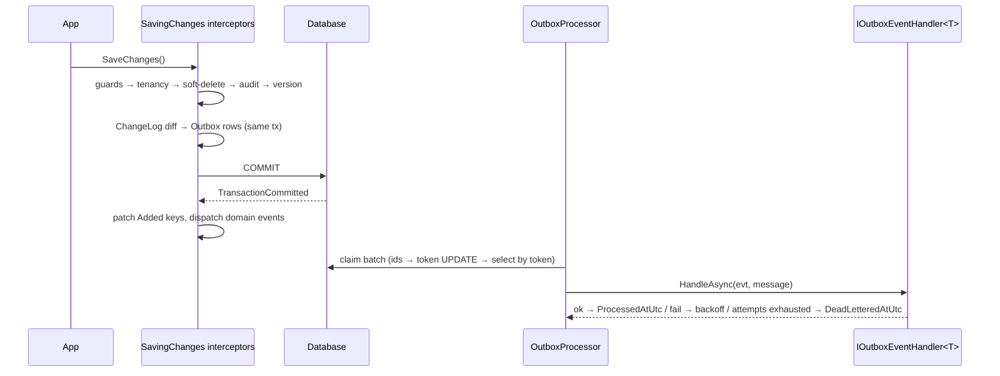
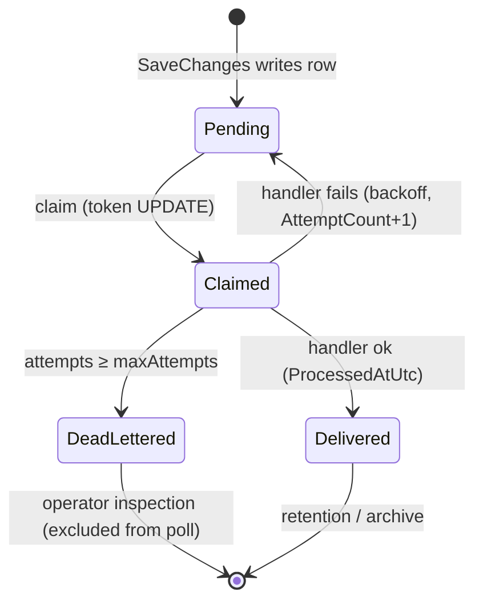
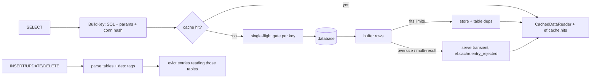

# Contributing to EfCore.Interceptors

## Local loop

```powershell
dotnet build EfCoreInterceptors.slnx -c Release
dotnet test EfCoreInterceptors.slnx -c Release
```

Tests target `net10.0` on SQLite in-memory (`tests/.../Infrastructure/TestInfrastructure.cs`).
The library itself dual-targets `net8.0;net10.0` — keep `#if NET10_0_OR_GREATER`
branches compiling on both (CI builds both TFMs).

## Adding an interceptor — checklist

1. **Contract first**: marker interface / attribute in `Abstractions/` (e.g. `IHasDomainEvents`, `[Encrypted]`).
2. **Interceptor** in the matching folder (`Saving/`, `Commands/`, `Materialization/`, …),
   one type per file, named `*Interceptor`.
3. **Ordering**: implement `IOrderedInterceptor` for `SaveChanges` interceptors and pick
   `Order` from the table below (guarded earlier → observable later).
4. **Setup method**: add `With*` to the matching partial
   (`EfInterceptorsSetup.Saving.cs` / `.Commands.cs` / `.Observability.cs`).
5. **Time**: take `TimeProvider` via ctor, never `DateTimeOffset.UtcNow` in hot paths
   (the `ArchitectureTests.No_Direct_UtcNow_Usage_In_Saving_Interceptors` test enforces it).
6. **Provider safety**: no `DateTimeOffset` comparisons and no `||` inside
   `ExecuteUpdate`/`ExecuteDelete` — SQLite/EF cannot translate them. Filter by
   equality/ids server-side, evaluate the rest client-side (see `OutboxProcessor`).
7. **Tests**: happy / boundary / failure / neighbor-interaction (≥4 per interceptor).
8. **Docs**: XML-doc on public API + `CHANGELOG.md` entry.

## Interceptor order contract

| Order | Stage | Members |
|---|---|---|
| −300 | validation | `Validation`, `CustomValidation` |
| −200 | guards | `MassOperationGuard`, `DeleteGuard`, `ImmutableGuard` |
| −150 | tenancy | `MultiTenancy` |
| −100 | soft delete | `SoftDelete` |
| 0 | audit | `Audit`, `ShadowAudit` |
| 50 | version | `VersionIncrement` |
| 100 | changelog | `ChangeLog` |
| 200 | outbox | `Outbox` |
| 300 | domain events | `DomainEvents` |
| 1000 | metrics/logging | `*Metrics*`, `*Logging*` |

Rules enforced by `ArchitectureTests`: guards run before anything observable
(metrics/logging must never record what guards reject); `ChangeLog (100)` runs
before `Outbox (200)` before `DomainEvents (300)`.

## Flows

### SaveChanges with outbox



### Outbox message states



### Second-level cache read path


